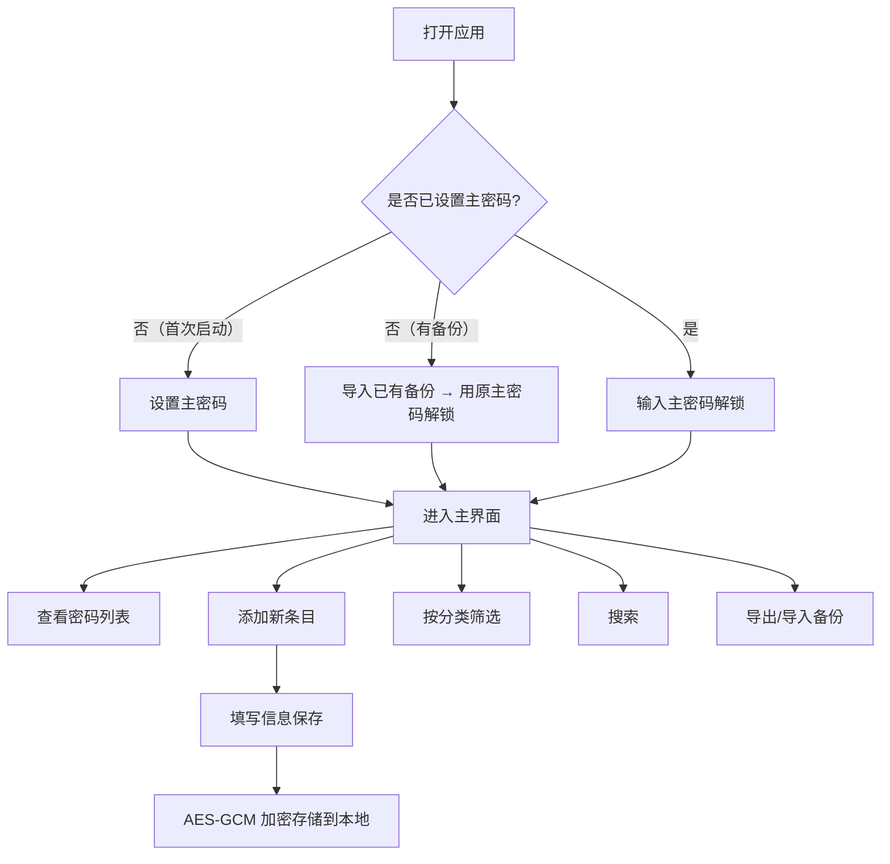
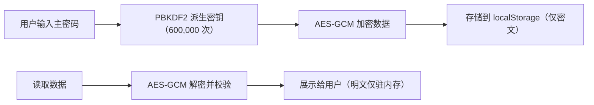
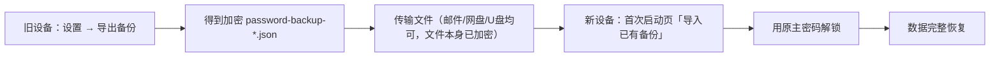

# 密码管理器 - 产品需求文档

## 1. 产品概述

一款安全、简洁的本地密码管理器 Web 应用，帮助用户安全存储和管理密码及重要信息。所有数据均在本地加密存储，不上传任何服务器，从根源保障隐私安全。

- **目标用户**：注重隐私安全、需要管理多个密码的个人用户
- **核心价值**：本地加密 + 零云依赖 + 简洁易用
- **支持内容**：应用软件密码、银行卡信息、账单地址信息三类

## 2. 核心功能

### 2.1 用户角色

| 角色 | 注册方式 | 核心权限 |
|------|----------|----------|
| 普通用户 | 设置主密码 | 完整使用所有功能，数据仅本地存储 |

### 2.2 功能模块

1. **登录 / 初始化页面**：设置主密码、解锁验证、**首次启动一键导入已有备份**
2. **密码列表主页**：条目展示、内置分类筛选、搜索
3. **条目详情 / 编辑**：新增、编辑、删除（密码 / 银行卡 / 账单三类）
4. **设置与备份**：导出加密备份、导入恢复、修改主密码、清空数据
5. **（规划中）自定义分类管理**：创建 / 编辑 / 删除用户自定义分类标签

### 2.3 页面详情

| 页面名称 | 模块名称 | 功能描述 |
|----------|----------|----------|
| 登录页面 | 主密码输入 | 首次使用设置主密码，后续验证解锁 |
| 登录页面 | 导入已有备份 | **首次启动**显示「📥 导入已有备份」按钮，一键迁移旧设备数据 |
| 登录页面 | 安全提示 | 提醒用户牢记主密码，无法找回 |
| 主页面 | 顶部导航 | 应用标题、搜索框、新增按钮、设置入口 |
| 主页面 | 分类侧边栏 | 内置三类（全部 / 密码 / 银行卡 / 账单），按类型筛选 |
| 主页面 | 密码卡片列表 | 网格展示条目，显示标题、账号/卡号、分类、复制按钮 |
| 主页面 | 空状态提示 | 无数据时引导用户添加第一条记录 |
| 条目弹窗 | 表单编辑 | 按类型显示对应字段（密码/银行卡/账单）、备注 |
| 条目弹窗 | 密码生成器 | 可配置长度和字符类型的强密码生成 |
| 条目弹窗 | 密码显隐 | 点击切换密码显示 / 隐藏 |
| 设置弹窗 | 数据备份 | 导出加密 JSON 备份文件 |
| 设置弹窗 | 数据恢复 | 从备份文件导入恢复数据 |
| 设置弹窗 | 修改主密码 | 验证旧密码后设置新主密码 |
| 设置弹窗 | 危险操作 | 清空所有数据（二次确认） |

## 3. 核心流程

### 用户主流程

### 加密存储流程

### 跨设备迁移流程

## 4. 用户界面设计

### 4.1 设计风格

- **整体风格**：简洁清新 + 轻盈简约，干净清爽，使用舒适
- **主色调**：白色 / 浅灰为背景，薄荷绿 (#34d399) 为主强调色
- **辅助色**：浅蓝灰用于分隔和边框，暖橙用于警告提示
- **按钮风格**：圆角矩形，主按钮实色填充，次按钮描边风格
- **字体**：Inter（Google Fonts），易读性优先
- **布局风格**：卡片式布局 + 轻柔阴影 + 充足留白
- **图标风格**：简洁线性图标，颜色柔和

### 4.2 页面设计概览

| 页面名称 | 模块名称 | UI 元素 |
|----------|----------|---------|
| 登录页面 | 登录卡片 | 居中白色卡片、锁图标、密码输入框、圆角按钮、首次启动含「导入已有备份」、淡入动画 |
| 主页面 | 顶部导航 | 固定顶部、白色背景、轻柔阴影、搜索框、圆形添加按钮、设置图标 |
| 主页面 | 分类侧边栏 | 左侧固定、浅灰背景、内置三类分类带图标、选中高亮 |
| 主页面 | 密码卡片 | 网格布局、悬停上浮、复制按钮、渐入动画 |
| 条目弹窗 | 模态框 | 半透明遮罩、白色弹窗、圆角、按类型显示表单、底部操作按钮 |
| 设置弹窗 | 设置面板 | 分组卡片、操作按钮、危险操作醒目标识 |

### 4.3 响应式

- 桌面端优先，自适应到平板和手机
- 移动端侧边栏收起为底部标签栏
- 卡片网格随屏幕宽度自动调整列数
- 触控区域优化，按钮最小高度 44px

### 4.4 动效设计

- 页面切换：淡入 + 轻微上移动画
- 卡片悬停：上浮 2px + 阴影加深
- 按钮点击：缩放反馈
- 密码复制：成功提示动效
- 弹窗出现：缩放 + 淡入，半透明遮罩

## 5. 安全与隐私

- **本地优先**：数据 100% 本地加密，不上传任何服务器
- **强加密**：PBKDF2-SHA256（600,000 次）+ AES-GCM 256，主密钥仅驻内存
- **零信任备份**：导出的备份为密文，迁移需原主密码；主密码遗失无法找回
- **传输安全**：安卓 PWA 经自带 HTTPS 服务器部署，含路径遍历防护与安全响应头
- **输入防护**：敏感字段禁用浏览器自动填充，内置 CSP 防脚本注入

## 6. 已知限制 / 规划中

- **自定义分类**：当前仅内置「密码 / 银行卡 / 账单地址」三类，用户自定义分类尚未实现（UI 占位未接入逻辑）。
- **闲置自动锁定**：暂未实现，当前依赖手动锁定与关闭页面清除密钥。
- **剪贴板明文残留**：复制密码后明文留存剪贴板，待优化为延时自动清除。
- **PWA 与 APK 数据隔离**：两者 localStorage 不互通，跨端通过备份迁移。
