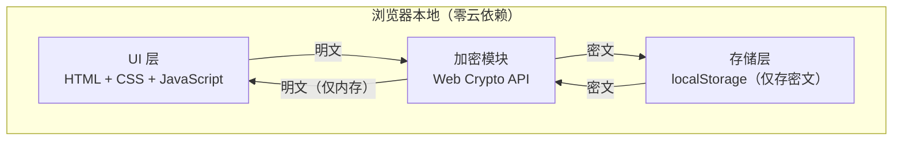
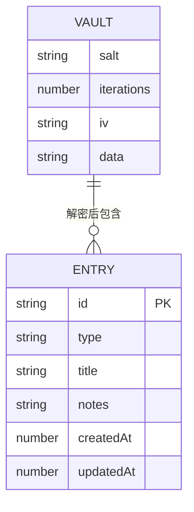

# 密码管理器 - 技术架构文档

## 1. 架构设计



- 主密码派生出的密钥**仅存在于内存**，页面关闭或手动锁定即清除，从不落盘。
- 所有持久化数据均为 AES-GCM 密文。

## 2. 技术说明

- **前端技术**：原生 HTML5 + CSS3 + JavaScript (ES6+)，无框架
- **构建工具**：无构建依赖，纯静态文件，开箱即用
- **加密算法**：
  - 密钥派生：PBKDF2 with SHA-256，**600,000 次迭代**（OWASP 2023 建议值）
  - 数据加密：AES-GCM 256 位（认证加密，同时提供机密性与完整性校验）
  - 随机盐值：每库独立生成，16 字节
  - 初始向量 IV：每次加密独立生成，12 字节
- **数据存储**：localStorage（仅保存密文）
- **离线能力**：Service Worker（`sw.js`）缓存静态资源，支持离线使用
- **字体**：Google Fonts - **Inter**
- **安全加固**：
  - HTTP 服务器（`https-server.js`）下发 CSP / X-Frame-Options / X-Content-Type-Options 响应头
  - 敏感表单字段 `autocomplete="off"` / `new-password`
  - 导入备份做结构化 + 密文可解码性校验

**技术选型理由**：
- 纯原生 JS：无依赖、易理解、小白也能看懂和修改
- Web Crypto API：浏览器原生加密，安全可靠，性能优秀
- 无构建步骤：双击 `index.html` 即可运行，部署最简单

## 3. 文件结构

```
/workspace
├── index.html            # 主页面（单页应用）
├── css/
│   └── style.css         # 样式文件
├── js/
│   ├── crypto.js         # 加密/解密/密码生成模块
│   ├── storage.js        # localStorage 读写 + 备份导入导出
│   ├── app.js            # 主应用逻辑（登录、增删改查、搜索、设置）
│   └── sw-register.js    # Service Worker 注册（独立文件以配合 CSP script-src 'self'）
├── https-server.js       # 本地 HTTPS 服务器（安卓 PWA 安装用，生成自签名证书）
├── sw.js                 # Service Worker（离线缓存）
├── manifest.json         # PWA 清单
├── capacitor.config.json # Capacitor 安卓打包配置
├── icons/                # 应用图标
├── certs/                # 运行时生成的 TLS 证书（建议 gitignore，勿提交）
└── .trae/documents/      # 项目文档
```

## 4. 数据模型

### 4.1 加密后存储结构（localStorage 中的 `password_vault`）

```json
{
  "v": 1,
  "salt": "base64 编码的随机盐值（16 字节）",
  "iterations": 600000,
  "iv": "base64 编码的初始向量（12 字节）",
  "data": "base64 编码的 AES-GCM 密文"
}
```

### 4.2 解密后数据结构（仅驻留内存）

```json
{
  "entries": [
    {
      "id": "uuid",
      "type": "password | bank | bill",
      "title": "微信",
      "notes": "备注",
      "createdAt": 1690000000000,
      "updatedAt": 1690000000000,
      "username": "...", "password": "...", "url": "...",
      "holder": "...", "cardNumber": "...", "bankName": "...",
      "pin": "...", "cvv": "...", "expiry": "...", "branch": "...",
      "lastName": "...", "firstName": "...", "gender": "...",
      "age": "...", "phone": "...", "country": "...", "line1": "...",
      "line2": "...", "city": "...", "state": "...", "zip": "..."
    }
  ],
  "settings": {
    "theme": "light"
  }
}
```

> 说明：条目按 `type` 分为 **密码 / 银行卡 / 账单地址** 三类，字段依类型不同而不同。当前**不支持用户自定义分类**（见第 7 节「已知限制」）。

### 4.3 ER 图



## 5. 核心模块说明

### 5.1 加密模块 (crypto.js)

| 函数 | 功能 |
|------|------|
| `deriveKey(password, salt, iterations)` | 使用 PBKDF2 从主密码派生 AES 密钥 |
| `encryptData(plaintext, key)` | 使用 AES-GCM 加密（每次随机 IV） |
| `decryptData(encryptedBase64, ivBase64, key)` | 使用 AES-GCM 解密并校验完整性 |
| `generateSalt()` | 生成 16 字节随机盐 |
| `generateIV()` | 生成 12 字节随机 IV |
| `generatePassword(length, options)` | 用 `crypto.getRandomValues` 生成强密码 |
| `generateId()` | 生成条目唯一 ID |

### 5.2 存储模块 (storage.js)

| 函数 | 功能 |
|------|------|
| `saveEncryptedData(obj)` | 保存密文到 localStorage |
| `loadEncryptedData()` | 读取密文 |
| `hasVault()` | 是否已创建密码库 |
| `clearVault()` | 清空数据 |
| `exportBackup()` | 导出加密 JSON 备份（文件名含日期） |
| `importBackup(file)` | 读取并校验备份（结构 + 密文可解码性） |

### 5.3 应用模块 (app.js)

- 登录 / 初始化与解锁（含**首次启动「导入已有备份」**入口）
- 三类条目（密码 / 银行卡 / 账单）的增删改查
- 内置分类侧边栏（按类型筛选）、搜索过滤
- 设置：导出 / 导入备份、修改主密码、清空数据
- 剪贴板复制、密码生成器、显隐切换
- UI 交互与事件绑定

### 5.4 部署工具 (https-server.js)

本地 HTTPS 服务器，专为安卓 PWA 安装设计：
- 首次运行用 OpenSSL 生成自签名证书至 `certs/`
- 路径遍历防护（强制限制在 web 根目录内）
- 禁止访问 `.pem` 私钥 / 证书文件
- 下发 CSP、X-Frame-Options、X-Content-Type-Options 等响应头

## 6. 安全设计

1. **零知识架构**：主密码只在内存中存在，从不存储；页面关闭或手动锁定即清除。
2. **端到端加密**：数据加密后才写入存储，解密仅在内存中完成。
3. **强密钥派生**：PBKDF2-SHA256 + 600,000 次迭代 + 每库随机盐，抵御离线暴力破解。
4. **认证加密**：AES-GCM 256 同时提供机密性与完整性，密文被篡改会解密失败。
5. **传输安全（部署态）**：HTTPS 服务器仅暴露必要端口、禁止敏感文件外发并下发安全响应头；应用内置 CSP 防御脚本注入。
6. **备份校验**：导入前校验结构合法性与密文可解码性，避免损坏文件覆盖现有数据。
7. **防凭据泄露**：敏感字段禁用浏览器自动填充；密码默认掩码，点击才显示。

> ⚠️ **待实现项**：闲置自动锁定（当前仅手动锁定 + 关闭页面清除密钥）；复制后自动清除剪贴板明文。

## 7. 已知限制 / 规划中

- **自定义分类**：当前分类为内置固定的「密码 / 银行卡 / 账单地址」三类，用户自定义分类标签尚未实现（存在 UI 占位但未接入逻辑）。
- **闲置自动锁定**：早期文档声称「闲置自动锁定」，当前未实现。
- **跨设备数据互通**：PWA 与 APK 各自使用独立 localStorage，数据不互通；跨设备需通过「导出 / 导入备份」迁移（首次启动页已提供一键导入）。
